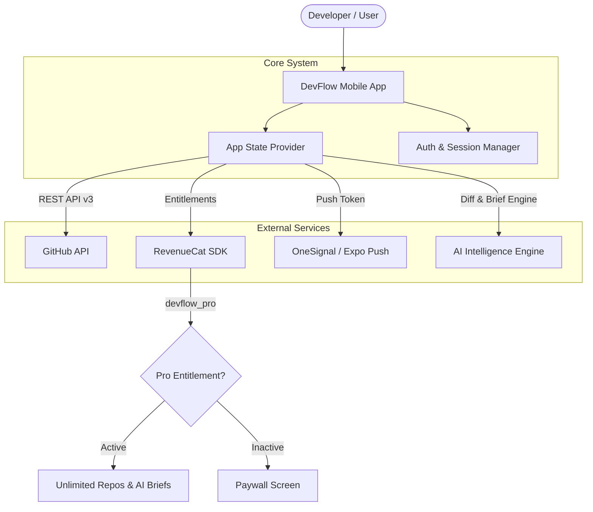

<div align="center">

# DevFlow

### AI-Powered GitHub & Hackathon Companion

> One mobile workspace for GitHub activity, developer alerts, hackathon deadlines, and AI-powered development assistance.

[](https://reactnative.dev)
[](https://expo.dev)
[](https://www.typescriptlang.org)
[](https://www.revenuecat.com)
[](https://onesignal.com)
[](https://docs.github.com/en/rest)

**Built for Shipaton 2026 — Next Gen**

</div>

---

## 🎯 Product Overview

### The Problem
Modern developers constantly context-switch across disconnected tools: checking GitHub pull requests, monitoring CI/CD pipeline builds, tracking hackathon submission deadlines, and consulting AI assistants for code reviews. On mobile devices, this fragmentation causes missed build failures, delayed PR reviews, and lost productivity.

### The DevFlow Solution
DevFlow consolidates your active engineering workspace into a single unified mobile experience. By pairing real-time GitHub REST API monitoring with AI-driven summaries, OneSignal push alerts, and RevenueCat subscription management, DevFlow gives developers actionable insights whenever critical events occur.

Whether monitoring an open-source project or building a hackathon submission, DevFlow ensures you stay focused on shipping code.

---

## ✨ Core Features

| Feature | What It Does |
| :--- | :--- |
| **GitHub Workspace** | Tracks monitored repositories, open pull requests, branches, and GitHub Actions build pipeline health. |
| **AI Daily Brief** | Delivers an automated morning digest of recent commit activity, pending PR reviews, and build failures. |
| **AI PR Insights** | Generates deep-dive explanations and risk assessments for pull request diffs. |
| **AI Commit Generator** | Formats structured conventional commit messages based on change descriptions. |
| **AI Companion Chat** | Interactive assistant capable of answering questions about repo health, PRs, and next priorities. |
| **Smart Alert Feed** | Real-time notification feed categorizing events by severity (`critical`, `important`, `informational`). |
| **Hackathon Tracker** | Manages project deadlines, submission status, milestone checklists, and countdown timers. |
| **DevFlow Pro** | Entitlement-gated premium tier unlocking unlimited repositories, AI briefs, and advanced alerts. |

---

## 🐙 GitHub Integration

DevFlow connects directly to GitHub using personal access tokens to deliver live repository intelligence:

- **Authentication**: Supports GitHub Personal Access Tokens (PAT) with encrypted on-device `SecureStore` persistence.
- **Repository Monitoring**: Fetches live repository metrics including star counts, open issues, default branches, and last activity timestamps.
- **Pull Request Tracking**: Displays open, draft, merged, and closed PRs alongside diff statistics (+additions, -deletions, file counts).
- **CI/CD Build Health**: Polls GitHub Actions workflow runs to identify failing builds (`failure`) or running pipelines (`in_progress`).
- **Commits Stream**: Inspects commit messages, SHA identifiers, authors, and timestamps.
- **Error & Rate Limit Resilience**: Handles GitHub API rate limits (HTTP 403) and token expiration (HTTP 401) with user-friendly recovery notices.

---

## ⚡ Smart Alerts & OneSignal

DevFlow features a dedicated notification engine that routes critical developer events straight to your device:

- **Build Breaks**: Immediate alerts when GitHub Actions CI/CD workflows fail on target branches.
- **Pull Request Updates**: Notifications for required PR code reviews or merged branches.
- **Hackathon Deadlines**: Timely warnings before project submission cutoffs.
- **OneSignal Integration**: Configured with `expo-notifications` and OneSignal push token handlers for background alert delivery and deep-link routing.

---

## 🤖 AI Features

DevFlow includes dedicated AI utilities designed for high-signal developer workflows:

### 1. AI Daily Brief
Provides a consolidated daily report summarizing yesterday's commit volume, pending pull request reviews, pipeline failures, and actionable recommendations.

### 2. AI PR Code-Diff Insights
Analyzes pull request diff metrics, target branches, and modification counts to produce a concise change summary and risk analysis.

### 3. AI Commit Message Generator
Transforms quick change descriptions into structured, conventional commit messages (e.g., `feat(auth): implement secure OAuth session persistence`).

### 4. AI Companion Chat
An embedded assistant equipped with predefined prompt chips to summarize daily repo activity, break down pull requests, and recommend task priorities.

---

## 🏆 Hackathon Tracker

Built specifically for hackathon developers and students, DevFlow includes a dedicated milestone companion:

- **Deadline Countdown Timers**: Real-time remaining time indicators for active hackathons.
- **Milestone Checklists**: Interactive task list breakdown categorized by feature, AI, and submission requirements.
- **Submission Progress**: Visual percentage bars tracking completion state from draft to ready for submission.

---

## 💳 DevFlow Pro & Monetization

DevFlow implements a freemium subscription model to gate advanced AI capabilities and multi-repository monitoring:

| Feature | Free Plan | DevFlow Pro ($4.99/mo) |
| :--- | :---: | :---: |
| **Monitored Repositories** | 1 Repository | **Unlimited Repositories** |
| **AI Daily Brief** | ❌ | **Included** |
| **AI PR Summaries** | ❌ | **Included** |
| **AI Commit Generator** | ❌ | **Included** |
| **Smart Alert Feed** | Basic | **Advanced** |
| **Hackathon Tracker** | 1 Active | **Multiple** |

---

## 🔐 RevenueCat Integration

DevFlow uses the official **RevenueCat React Native SDK** (`react-native-purchases` v10.10.2) to manage mobile subscriptions and entitlement state.

### Development Configuration
- **Store**: RevenueCat Test Store
- **Offering ID**: `default`
- **Package ID**: `$rc_monthly`
- **Product ID**: `devflow_pro_monthly`
- **Entitlement ID**: `devflow_pro`
- **Price**: `$4.99/month`

### Technical Architecture
- **Entitlement Validation**: Pro status is determined strictly by evaluating server-side customer entitlements via `customerInfo.entitlements.active['devflow_pro']`.
- **Purchase Flow**: The Subscribe button calls `Purchases.purchasePackage(monthlyPackage)` using the active `$rc_monthly` package.
- **Restore Purchases**: Tapping Restore Purchases executes `Purchases.restorePurchases()` and re-verifies entitlement state.
- **No Mock Purchases**: If the RevenueCat SDK key is unconfigured, the app operates in Demo Mode displaying clear configuration notices without simulating fake purchases.

> ℹ️ **Developer Note**: RevenueCat Test Store configuration is used for development. Google Play production merchant billing is not enabled in this sandbox environment.

---

## 🛠️ Technology Architecture

| Layer | Technology |
| :--- | :--- |
| **Mobile Framework** | Expo SDK 57 / React Native 0.86 |
| **Language** | TypeScript (100% strict check) |
| **Navigation** | Expo Router (File-based routing) |
| **Submitting & Billing** | RevenueCat (`react-native-purchases`) |
| **Push Notifications** | OneSignal / `expo-notifications` |
| **Developer API** | GitHub REST API v3 |
| **State & Storage** | React Context & `expo-secure-store` |



---

## 🚀 Installation & Local Setup

### Prerequisites
- Node.js (v18+)
- npm or yarn
- Physical Android/iOS Device or Emulator

### Setup Steps

1. **Clone the repository**:
   ```bash
   git clone https://github.com/varshithaaaagedda/DevFlow.git
   cd DevFlow
   ```

2. **Install dependencies**:
   ```bash
   npm install
   ```

3. **Configure Environment Variables**:
   Create a `.env` file in the root directory:
   ```env
   EXPO_PUBLIC_REVENUECAT_ANDROID_KEY=test_lxeZWsYyuULmTpOTgRJqGAqOGGt
   ```

4. **Start the Expo Development Server**:
   ```bash
   npx expo start
   ```

---

## ⚠️ Known Limitations

- **Google Play Production Publishing**: Production Google Play Store submission and live merchant account linking are out of scope for the hackathon sandbox build.
- **Expo Go Native Billing**: Testing real in-app store billing requires an EAS development build (`npx eas-cli build --profile development --platform android`) because standard Expo Go does not bundle native store billing binaries.

---

## 📄 License

This project is licensed under the [MIT License](LICENSE).
